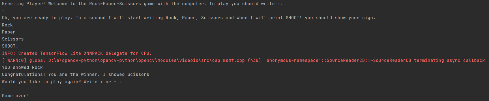

# 13.12.21
### Начало работы. Придуман и написан алгоритм распознавания камня и бумаги.

# 14.12.21
### Написано распознавание ножниц. Также проведен подгон параметров для улучшения точности распознавания.

# 20.12.21
### Создан первый образец игры. Пользователя компьютер встречает строками, описывающие процесс игры. Затем со счёта компьютера игрок показывает знак, и программа сопоставляет его со своим и выводит победителя.

##### Желательно в будущем убрать эти некрасивые красные строки.
# 21.12.21
### Исправлен баг с плохим распознаванием камня. Также были внесены некоторые изменения в сам игровой процесс и в целом в оформление кода. 